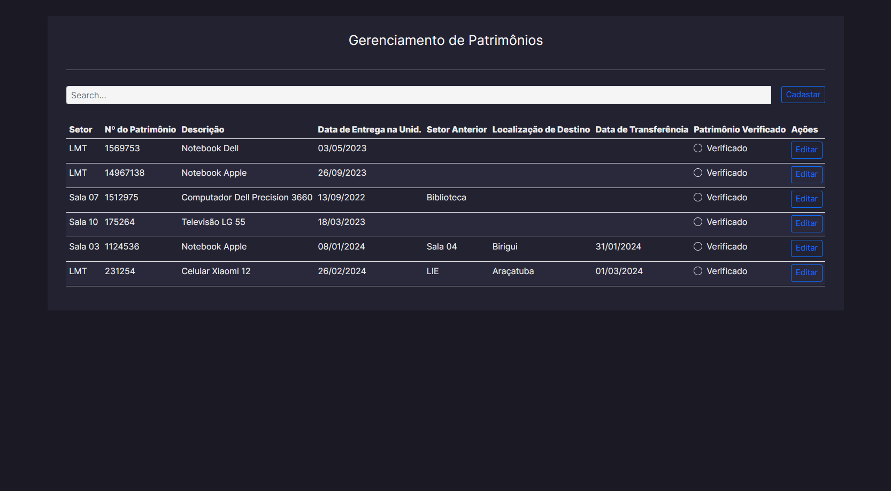
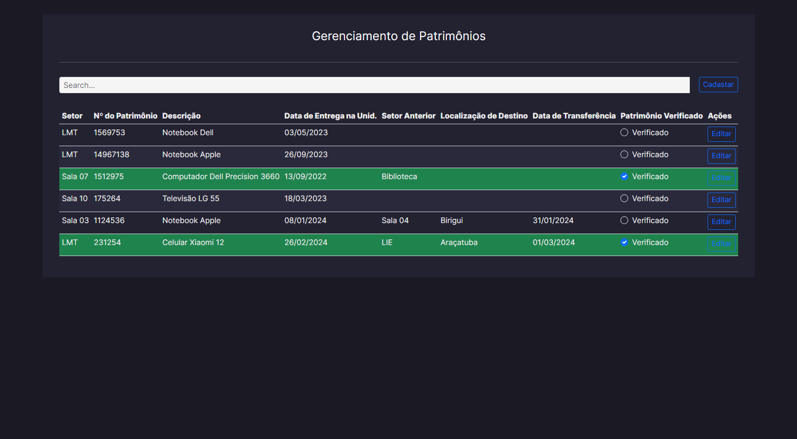

## Sistema de Gerenciamento de Patrimônios

 

  
   
  
   
  
   
  

 
 

## 🚀 Tecnologias

Esse projeto foi desenvolvido com as seguintes tecnologias:

- ReactJS
- NodeJS
- bootstrap
- cors
- dotenv
- express
- mongodb
- react-dom
- mongoose
- react-bootstrap
- axios
- jsonwebtoken
- react-router-dom
- bcrypt

## 💻 Projeto

Este projeto foi desenvolvido com o objetivo de criar uma solução eficiente para a localização e o controle do patrimônio de uma escola. 
O sistema permite registrar e acompanhar, de forma precisa, a entrega de bens entre diferentes unidades, além de monitorar os dados de envio
e a atualização local de cada item. Dessa forma, a gestão do patrimônio se torna mais organizada e transparente, facilitando a administração e 
evitando a perda ou extravio

## ✉️ [Contato](https://hugolino.dev)

hugolino2609@gmail.com
